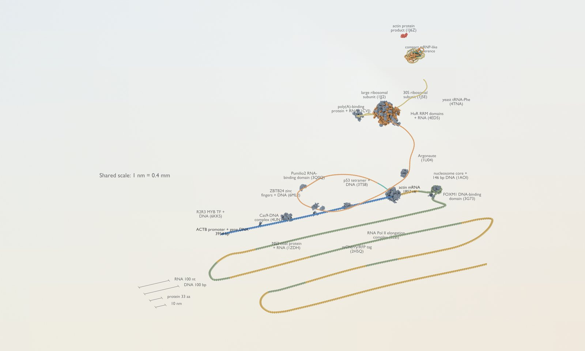
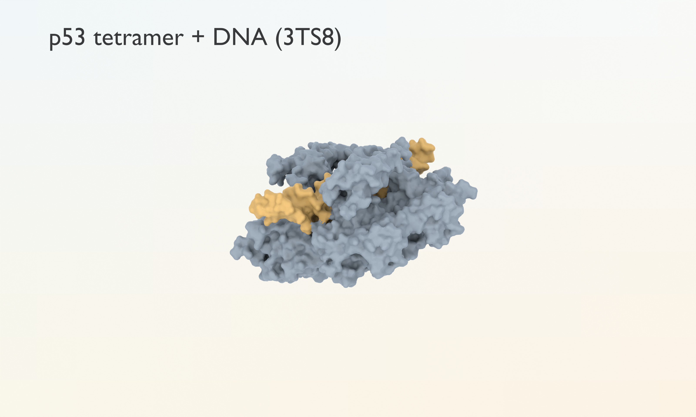
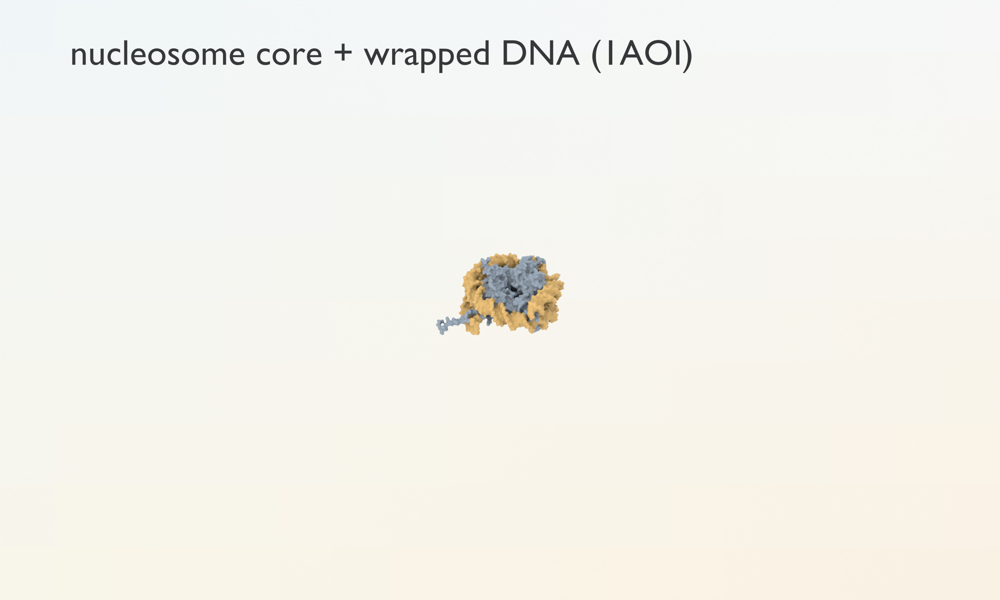
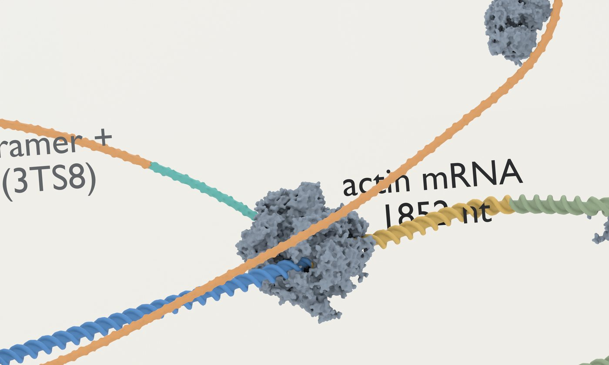
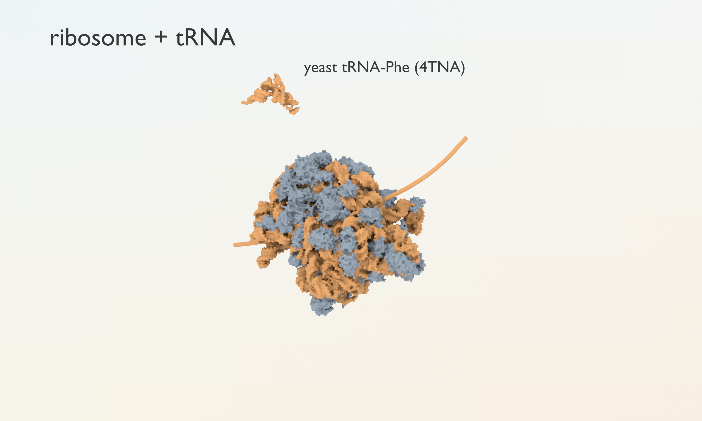
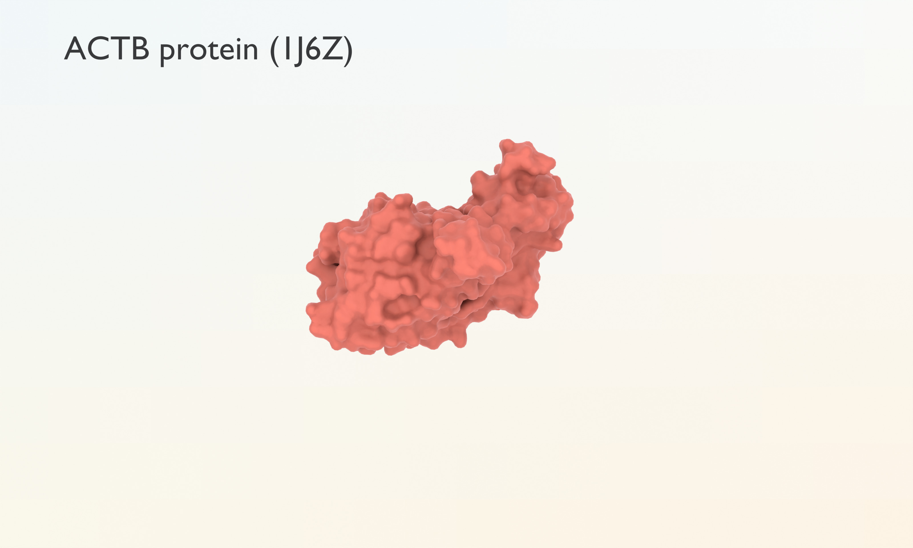
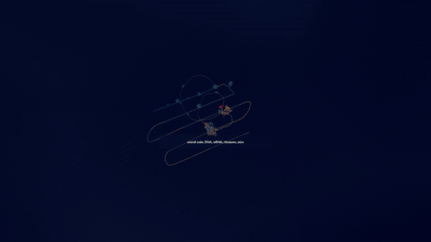

# Gene Regulation at Scale in 3D

A three-dimensional sculpture of transcriptional and post-transcriptional control of gene expression. The scene follows a gene DNA path, mRNA spiral, to the final protein product for actin (ACTB). It includes RNA- and DNA-bound regulatory proteins, polymerase ii, Cas9, and the ribosomal translation machinery. And it is scale-accurate!



## Render Details

| p53 tetramer with DNA | Nucleosome loop |
| --- | --- |
|  |  |

| RNA polymerase II | Ribosome and tRNA |
| --- | --- |
|  |  |



## What Is Being Build Here
- Scale-accurate 3D scene. 
- Full ACTB promoter-plus-gene DNA path: `3,454 bp` canonical ACTB span plus `500 bp` upstream promoter, for `3,954 bp` total.
- Full-length actin mRNA: `1,852 nt`, split into `5' UTR`, coding sequence, and `3' UTR` segments.
- Blender-generated DNA/RNA proxies at one shared physical scale.
- Reduced surfaces for PyMOL PDB-derived proteins and nucleoprotein complexes.
- Current PDB-derived scene assets include RNA polymerase II elongation complex `2E2I`, ribosome subunits `1J5E` and `1JJ2`, tRNA `4TNA`, nucleosome `1AOI`, Cas9 `4UN3`, transcription factors `6ML2`, `6KKS`, `3TS8`, and `3G73`, RNA-binding proteins `1U04`, `1CVJ`, `4ED5`, `3Q0Q`, and `1ZDH`, mCherry/RFP tag `2H5Q`, and actin protein `1J6Z`.
- PDB-derived molecular surfaces with generated DNA/RNA meshes at shared scale: `1 nm = 0.4 mm`.
- Note: this is of course not a realistic situation from a crowded cell. Also, between transcription and before translation the mRNA would need to be exported from the nucleus. 

## Flythrough Animation (in-progress)



A separate [flythrough animation experiment](experiments/v5_flythrough_animation/README.md) exports a cinematic camera flight. 

## 2017 Poster

This project builds on a poster about gene expression control at molecular scale that I made in 2017. 


Original source note:

> Transcriptional- and posttranscriptional control of gene expression in scale. All structures from David Goodsell & RCSB PDB. Main parts from https://mm.rcsb.org. The mRNA and the idea of the scale of actin mRNA to actin protein from https://book.bionumbers.org/which-is-bigger-mrna-or-the-protein-it-codes-for/ and I took other molecules from "molecules of the month" https://pdb101.rcsb.org/motm/181 https://pdb101.rcsb.org/motm/98 https://pdb101.rcsb.org/motm/112 https://pdb101.rcsb.org/motm/31.

See [docs/references.md](docs/references.md) for source links, PDB IDs, and attribution details.


## Build from Scripts

Run the complete V5 build from a PowerShell prompt:

```powershell
.\scripts\run_canonical_v5_workflow.ps1
```

For a quick rebuild that reuses already downloaded/exported/reduced assets:

```powershell
.\scripts\run_canonical_v5_workflow.ps1 -SkipFetch -SkipPyMolExport -SkipReduction
```

Canonical V5 outputs are written to:

- `outputs/canonical/gene_expression_surface_style_v5.blend`
- `outputs/canonical/preview_gene_expression_surface_style_v5.png`
- `outputs/canonical/gene_expression_surface_scene_v5_report.json`

V5 detail previews are written beside the main preview:

- `outputs/canonical/preview_gene_expression_surface_style_v5_full_overview.png`
- `outputs/canonical/preview_gene_expression_surface_style_v5_p53_dna.png`
- `outputs/canonical/preview_gene_expression_surface_style_v5_polymerase_rna_start.png`
- `outputs/canonical/preview_gene_expression_surface_style_v5_nucleosome_loop.png`
- `outputs/canonical/preview_gene_expression_surface_style_v5_ribosome_trna.png`
- `outputs/canonical/preview_gene_expression_surface_style_v5_actin_product.png`

The V5 build uses:

- `config/scene_manifest_v5.json` for the versioned scene manifest, derived from `config/scene_manifest.json`.
- `scripts/fetch_rcsb_assets.py` to fetch mmCIF files.
- `scripts/export_pymol_surface_assets.py` to export PyMOL molecular surfaces.
- `scripts/reduce_surface_assets.py` to weld and decimate OBJ surfaces for Blender.
- `scripts/blender_nucleic_meshes.py` to build scale-correct direct Blender DNA/RNA meshes.
- `scripts/build_gene_expression_surface_scene_v5.py` to arrange and render the final scene.

More details in [docs/workflow.md](docs/workflow.md).

## Experiments

Experiments to try out variations or new features are isolated under `experiments/`:

- `experiments/arrangement_variants/`: DNA/RNA-only layout comparisons.
- `experiments/procedural_nucleic_acids/`: custom-vs-PyMOL-calibrator-vs-Molecular-Nodes DNA/RNA comparisons.
- `experiments/rna_structure_variants/`: scale-accurate elongated and compact RNA folding candidates with explicit stems and base pairing.
- `experiments/v5_flythrough_animation/`: educational camera flight and README GIF preview.