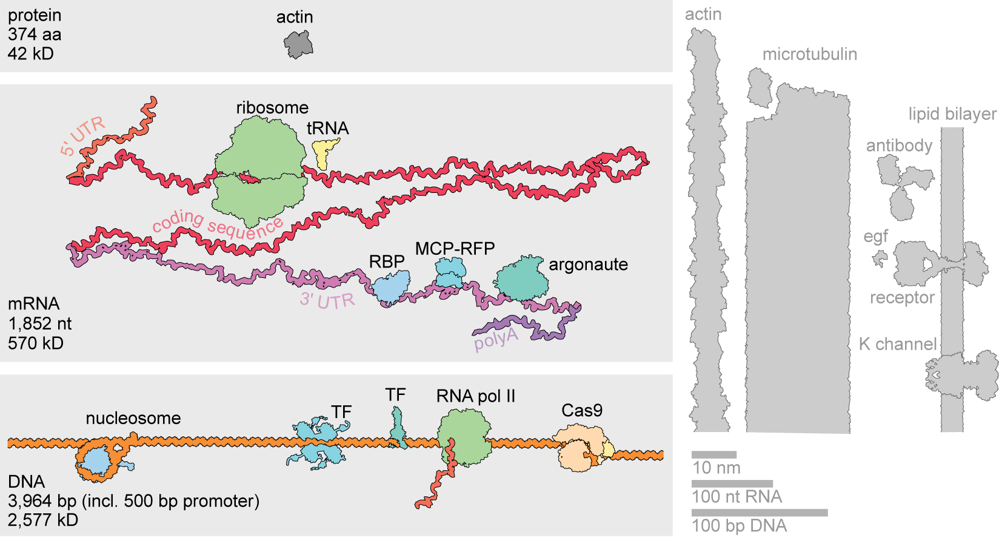

# 3D Gene Expression Scene

A three-dimensional sculpture of transcriptional and post-transcriptional control of gene expression. The scene follows a gene DNA path, mRNA spiral, to the final protein product for actin (ACTB). It includes RNA- and DNA-bound regulatory proteins, polymerase ii, Cas9, and the ribosomal translation machinery. The relative scale of molecules is accurate. 


## Render Details

These close-ups use individual framing and a calibrated nanometer scale bar in each image. The original shared-scale detail renders remain available for direct size comparisons.

|  |  |
| --- | --- |
|  |  |

|  |  |
| --- | --- |
|  |  |

|  |  |
| --- | --- |
|  |  |

## What Is Being Built Here
- Scale-accurate 3D scene, at shared scale: `1 nm = 0.4 mm`.
- ACTB promoter-plus-gene DNA: `3,454 bp` canonical ACTB, plus `500 bp` upstream promoter = `3,954 bp` total.
- Actin spliced mRNA: `1,852 nt`, split into `5' UTR`, coding sequence, and `3' UTR` segments.
- RNA polymerase II sits at the gene endpoint, where the full transcript's nascent `3′` end remains attached. Splicing is not shown, mRNA shown in final spliced form.
- Note: this is of course not a realistic situation in a densely crowded cell. Also, between transcription and before translation the mRNA would need to be exported from the nucleus. 

See [docs/references.md](docs/references.md) for PDB IDs and source links.

## Flythrough

The current film is a 66-second dark molecular journey at 1080p/24 fps, with gentle focus shifts, light sweeps, a six-second ribosome passage, and a four-second actin hold. The GIF below plays at 1x speed.

Build or resume it with `./animation/run_flythrough_animation.ps1`. The scene, final/review MP4s, playback page, and validation report are in `outputs/animation/`. See [the animation workflow](animation/README.md).

<p align="center">
  
</p>

## 2D Collage

This project builds on an illustration I made in the past.



> Transcriptional- and posttranscriptional control of gene expression in scale. Assembled as collage in Photoshop, then traced-, re-arranged-, and re-colored in Illustrator. Structures and components from: RCSB Protein Database & Bionumbers book. Main parts from https://mm.rcsb.org. The mRNA and the idea of the scale of actin mRNA to actin protein from https://book.bionumbers.org/which-is-bigger-mrna-or-the-protein-it-codes-for/ and other molecules from "molecules of the month" https://pdb101.rcsb.org/motm/181 https://pdb101.rcsb.org/motm/98 https://pdb101.rcsb.org/motm/112 https://pdb101.rcsb.org/motm/31.

See [docs/references.md](docs/references.md) for source links and attribution details.


## Build from Scripts

Run the complete canonical build from a PowerShell prompt:

```powershell
.\scripts\run_canonical_workflow.ps1
```

For a quick rebuild that reuses already downloaded/exported/reduced assets:

```powershell
.\scripts\run_canonical_workflow.ps1 -SkipFetch -SkipPyMolExport -SkipReduction
```

Canonical outputs are written to:

- `outputs/canonical/gene_expression_surface_style.blend`
- `outputs/canonical/preview_gene_expression_surface_style.png`
- `outputs/canonical/gene_expression_surface_scene_report.json`

Detail previews are written beside the main preview:

- `outputs/canonical/preview_gene_expression_surface_style_full_overview.png`
- `outputs/canonical/preview_gene_expression_surface_style_p53_dna.png`
- `outputs/canonical/preview_gene_expression_surface_style_polymerase_gene_end.png`
- `outputs/canonical/preview_gene_expression_surface_style_nucleosome_loop.png`
- `outputs/canonical/preview_gene_expression_surface_style_ribosome_trna.png`
- `outputs/canonical/preview_gene_expression_surface_style_actin_product.png`
- `outputs/canonical/preview_gene_expression_surface_style_cas9_dna.png`

The build also produces a `_closeup.png` counterpart for each of the six detail previews and refreshes the overview and close-up JPEGs in `docs/images/` together. Final stills use 256 Cycles samples with denoising; set `CANONICAL_PREVIEW=1` for 64-sample previews.

The canonical build uses:

- `config/scene_manifest.json` as the single resolved scene manifest.
- `scripts/fetch_rcsb_assets.py` to fetch mmCIF files.
- `scripts/export_pymol_surface_assets.py` to export PyMOL molecular surfaces.
- `scripts/reduce_surface_assets.py` to weld and decimate OBJ surfaces for Blender.
- `scripts/blender_nucleic_meshes.py` to build scale-correct direct Blender DNA/RNA meshes.
- `scripts/build_gene_expression_surface_scene.py` to build the gene-end arrangement and render the final scene.

More details in [docs/workflow.md](docs/workflow.md).

## Sketchfab Exports

Upload-ready molecular-scene exports are written to `outputs/sketchfab/`:

- `gene_expression_canonical_sketchfab.glb` (preferred)
- `gene_expression_canonical_sketchfab.fbx` (fallback)

Regenerate them from the canonical blend with:

```powershell
.\scripts\run_sketchfab_export.ps1
```
